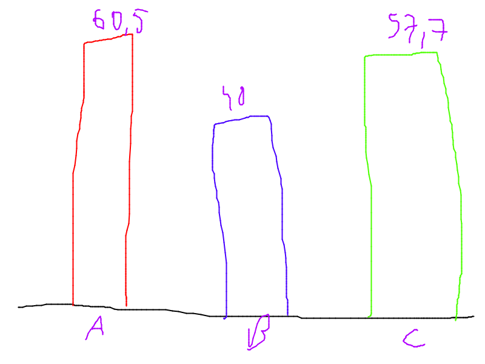

# Zadanie

Używając stworzonej wcześniej biblioteki SVG, stworzyć bibliotekę do tworzenia wykresów słupkowych.

```
Wykres w;

w.dodaj_slupek(Slupek{60.5, "A", "red"});
w.dodaj_slupek(Slupek{40, "B", "blue"});
w.dodaj_slupek(Slupek{57.7, "C", "green"});

zapisz_wykres_jako_SVG(w, "wykres1.svg", 800, 600);
```

Szkic:



```
zapisz_wykres_jako_txt(w, "wykres1.txt");
```

Przykład:
```
A:      XXXXXXXXXXXXXXXXXXXX    60.5
B:      XXXXXXXXXXXXXXX         40
C:      XXXXXXXXXXXXXXXXXXX     57.7
```

Inne formaty do przemyślenia:
- NetPBM
- PNG
- HTML
- itd.